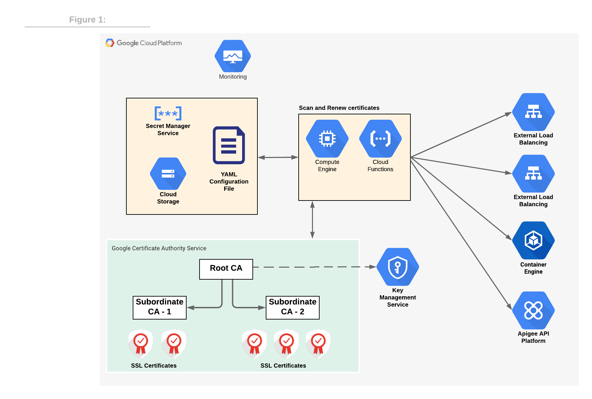

# GCP-CA-Service-Helper-Scripts

This repository includes helper scripts for the Google Cloud Certificate Authority Service. Currently the script support GCP Load Balancer Auto-Renewal.

## System requirements
Currently, this GCP-CA-Service-Helper-Script uses both GCP Python3 SDK and the [gcloud command-line tool](https://cloud.google.com/sdk/gcloud). To install gcloud and Python3 SDK on a GCP Compute (VM) follow the installation instructions from [this link](https://cloud.google.com/sdk/install).

Note: the script cannot be executed as [Cloud Function](https://cloud.google.com/functions), in the next version of the script gcloud command will be replaced with Python3 and then the script can be deployed as Clod Function.

## Installation
Clone the repository and run the next commands.
```sh
pip3 install -r requirements.txt
export CLOUDSDK_PYTHON_SITEPACKAGES=1;
 ```

## Usage:
 ```sh
 python3 private_ca_renew_lb_in_project.py <project-id> <private-ca-subordinate-name>
 ```


## Renew Load-Balancers self-managed certifications in a project
### Overview:
This script rotates load balancers SSL certificate when the certificate's remaining cert-life is less then a threshold. For example, if remaining cert-life threshold is set to  50%, then a 30 days cert will be renewed 15 days before expiration. If remaining cert life threshold is set to 90%, then a 24hrs cert will be renewed 2.4hrs before certification expiration.
The script assumes all certificates are issued from a pre-configured subordinate CA named 'private-ca-subordinate-name'.

The script is designed to run as a [cron job ](https://www.hostgator.com/help/article/what-are-cron-jobs), the certificate(s) installed on the resources listed in the YAML configuration file will be queried for certificate life-span and renewed if needed. The frequency in which this script executes depends on the certificates' life-span, for example if the certification are issued for 24 hours and expected to be renewed 6 hours before expiration, then the script should be executed every 4 hours with the following crontab schedule expression: ```0 */4 * * *```


## Architectural overview:



The YAML file binds between resources on the right (such as load balancer) and a subordinate CA. For example the following snippes binds a global load balancer called “demo-lb-target-proxy” with a subordinate CA “server-tls-2”. The cert_renew_ratio indicates the portion of the certification validity time before renewal, for example 70 means that the certificate will be renewed after 70% of its life span (e.g.: if the certificate has been issued for 100 minutes, it will be renewed after 70 minutes).

YAML File configuration:
```ssl_resources:
  "load-balancer":
    type: "GLB" #Global Load Balancer
    name: "demo-lb-target-proxy"
    subordinate-ca: "server-tls-2"
    cert_renew_ratio: 70
```

GCP Secret Manager or Cloud Storage are recommended to store the YAML configuration file.


## Auditing and Logging:
Each operation performed on the Google Certificate Authority is logged in Cloud Logging, in addition alerts and notifications can be configured based on metrics. For example a notification can be delivered to Pub/Sub anytime Root CA configuration has changed. The script is designed to extend SSL-based resources certification automation and we are welcoming pull requests.
